# CBC Bit-flipping Attack 

 ## Introduction
 
 通过 CBC Bit-flipping 攻击实验，学习 CBC Bit-flipping。如果给定一个加密的值，CBC Bit Flipping 可以用于更改一个解密的纯文本信息。如果系统使用纯文本进行决策（例如用户权限级别），则系统可能会受到 CBC Bit Flipping 的影响。实验方法主要是更换初始向量 IV 的位和字节并观察对应文本的变化，只更改会影响目标文本的位或字节的初始向量。文本信息量少的情况下可以被暴力破解，但是为了得到更好的攻击效果，需要计算出生成文本对应的初始向量值。  

 ## CBC Cipher Block Chaining

 CBC 模式一对一个明文分组加密，每次加密使用同一密钥，加密算法的输入是当前明文分组和前一次密文分组的异或，因此加密算法的输入不会显示出与这次的明文分组之间的固定关系，所以重复的明文分组不会在密文中暴露出这种重复关系。  
 
 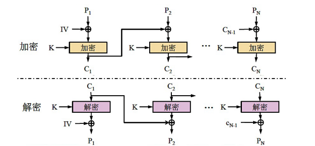  
 
 由于引入了反馈，CBC 可以将重复的明文分组加密成不同的密文分组，克服了 ECB 的弱点。然而，CBC 仅在前面的明文分组不同时才能将完全相同的明文加密成不同的密文分组，因此，任意两则消息  在它们的第一个不同之处出现前，将被加密成同样的结果。防止这种情况发生的办法是用加密随机数据作为第一个分组，即初始化向量 IV(Intial Vector),IV 能使加密前的消息唯一化。从安全性的角度，IV 应该同密钥一样被保护，如果敌手篡改 IV 中的某些比特，则接收方收到的第中相应的比特也发生变化。  

 ### CBC Bit-flipping

 CBC 通过消除文本信息中的重复部分提高了密文的完整性。当然，交换，复制或者删除密文会破坏至少一个消息块，然而异或的操作是线性的，改变前一个块中密文的一个比特会对当前明文块中相应的比特产生后果。    
 
 | A | B | A XOR B |
 | :----:| :----: | :----: |
 | 0 | 0 | 0 |
 | 0 | 1 | 1 |
 | 1 | 0 | 1 |
 | 1 | 1 | 0 |
 
 根据上表，无论 B 的值是多少，改变 A 的值总是导致输出值相对于 B 的值发生翻转。这就是如果攻击者更改前一个块中的某一位，这个翻转就会导致下一个块中的相应位的值发生改变。在 CBC 中，明文和前一个密文块（或初始向量）的混合发生在加密之前。异或操作时尊重位顺序块。先验密文的第一位与明文的第一位进行异或运算，依此类推。如果密文的第 3 位之前的密文（或 IV）被切换，明文的第 3 位将在加密之前被翻转。如下图：    
 
     

 ## 解决 CBC Bit-flipping 挑战

 ### 实验前准备

 - Step 0.准备好 Docker 环境    
 ```
 # 在 Ubuntu20.04 上安装 Docker 
 # Update the apt package index and install packages to allow apt to use a repository over HTTPS:
 sudo apt-get update
 sudo apt-get install \
    ca-certificates \
    curl \
    gnupg \
    lsb-release
 # Add Docker’s official GPG key:
  sudo mkdir -p /etc/apt/keyrings
 curl -fsSL https://download.docker.com/linux/ubuntu/gpg | sudo gpg --dearmor -o /etc/apt/keyrings/docker.gpg
 # Use the following command to set up the repository:
  echo \
  "deb [arch=$(dpkg --print-architecture) signed-by=/etc/apt/keyrings/docker.gpg] https://download.docker.com/linux/ubuntu \
  $(lsb_release -cs) stable" | sudo tee /etc/apt/sources.list.d/docker.list > /dev/null
  ```
 - Step 1. 安装 OWASP ZAP 并与 Firefox 连接本地代理
 - Step 2. 拉取镜像并直接在本地运行
 `sudo docker run -d --name mutillidae -p 8081:80 c4pr1c3/dockermutillidae`
 - Step 3. 打开浏览器（本实验用 Mozilla Firefox 最新版）访问 http://192.168.56.101:8081/
 
 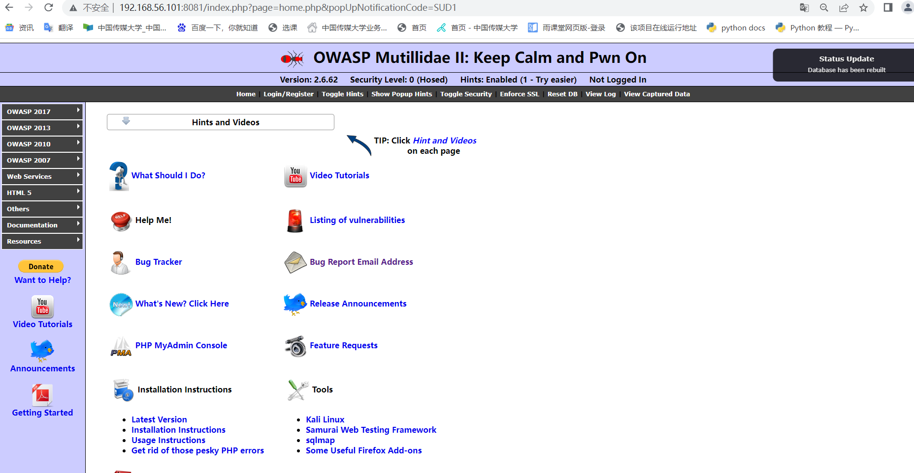  
 
 - Step 4. 点击页面上的超链接`setup/reset the DB` 弹出提示选择「确定」完成数据库初始化
 
 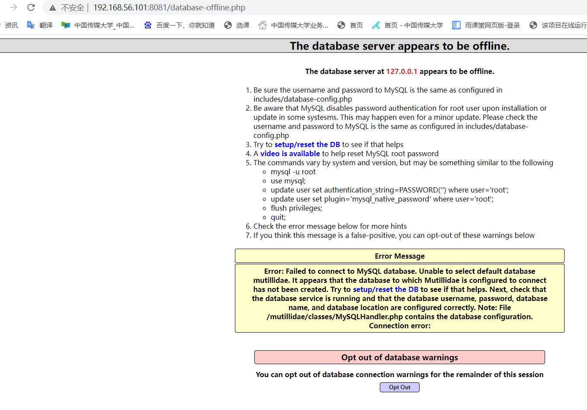  
 
 - Step 5. 在左侧导航栏中依次选择 OWASP 2017 -> A2 - Broken Authentication and Session Management -> Priviliege Escalation -> Via CBC-bit Flipping
  
 ### 实验要求

 默认情况下，User ID 和 Group ID 设置为 "100"，挑战是使用 CBC Bit-flipping Attack 将 User ID 和 Group ID 设置为"000"，使得普通用户变为根用户。   
 
 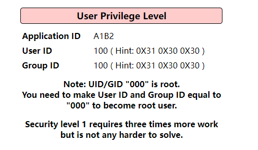    

 ### 定位易受攻击的字节  

 尝试对给定的块进行 CBC 比特翻转攻击，可以锁定初始向量为目标。观察 URL 可以发现参数`iv=6bc24fc1ab650b25b4114e93a98f1eba`。首先，进行一些非正式的测试，通过更改 IV 的某些值来观察页面的变化。    
 
 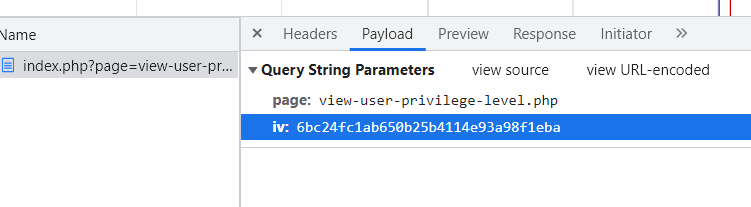   
 
 - 测试 1  
 将前两个字符更改为 00，Application ID 的值从 A1B2 变成了 *1B2   
 
 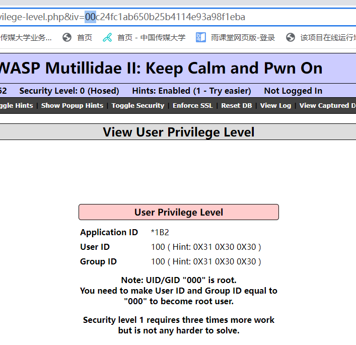   
 
 - 测试 2   
 Application ID 的默认值为 A1B2，将 IV 的第一个字符从 6 更改为 7 时，Application ID 更改为 Q1B2，相应地，通过不断更改前 8 个字符，发现只有 Application ID 发生变化，也就可以推断前 8 个字符两个为一组分别对应四位 Application ID 。    
 
 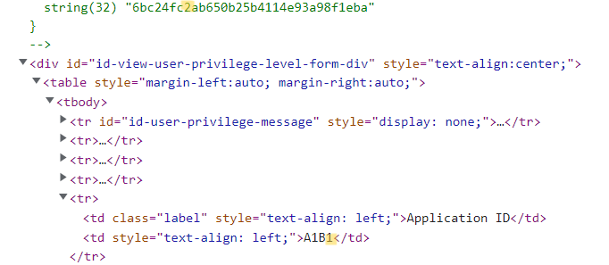    
 
 - 测试 3  
 更改第 9 至第 14 位字符，只有 User ID 发生变化。   
 
 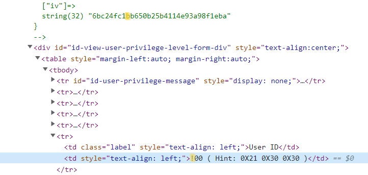
 
 - 测试 4 
 更改第 15 至第 20 位字符，只有 Group ID 发生变化。   
 
 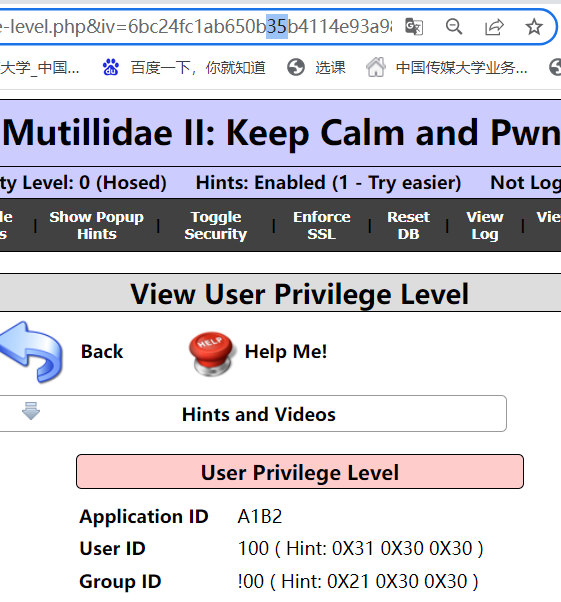   
 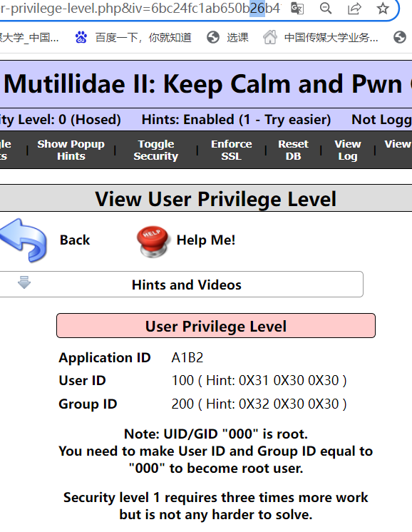    
 
 - 测试 5  
 更改第 21 至第 32 位字符，页面没有变化。   
 可以得出下表，按照位置 IV 的值对应的效果影响。   
 
 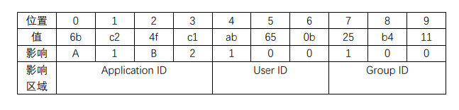   

 ### 如何修改易受攻击的字节  

 根据表格，可以手动更改 IV 值直到页面更新为 root 用户，但是可以看出字节被编码为 ASCII 十六进制，因此每个字节有 256 个值  
 范围从 00 到 FF，更换 IV 值并重新提交 URL 最多可达 512 次，因此需要尝试一种更快速的方法。        
 使用 OWASP Zed Attack Proxy ，对关键字节进行模糊测试（Fuzz），对字节 5 的默认值 ab 进行 16 进制 0-9，a-f 的注入，共 256 种组合。    
 
 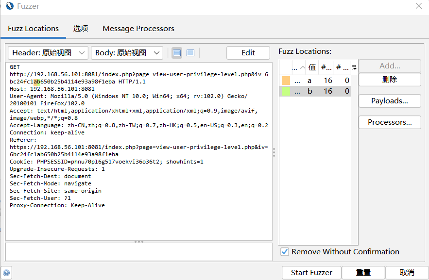    
 
 模糊测试结果显示在某个注入的数值有一个 HTTP 响应对应的 User ID 为 000。在网页上通过查找工具，User ID 为 100 时对应的 HTML 表格数据元素为`<td style="text-align: left;">100 ( Hint: 0X31 0X30 0X30 )</td>`    
 
 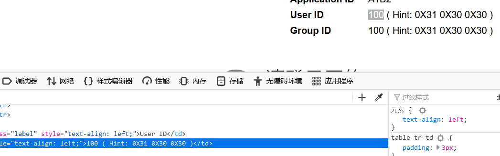    
 
 就能得出，当 User ID 为 000 时，对应的 HTML 表格数据元素类似`<td style="text-align: left;">000 </td>`  
 只需要在 OWASP Zed Attack Proxy 搜索栏中搜索`<td style="text-align: left;">000`对应 HTTP Fuzz Results    
 
 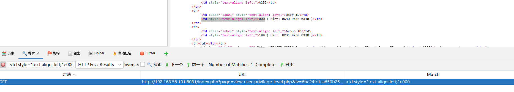    
 
 在请求中查看 User ID 为 000 时对应的字节 5 值为 aa    
 
 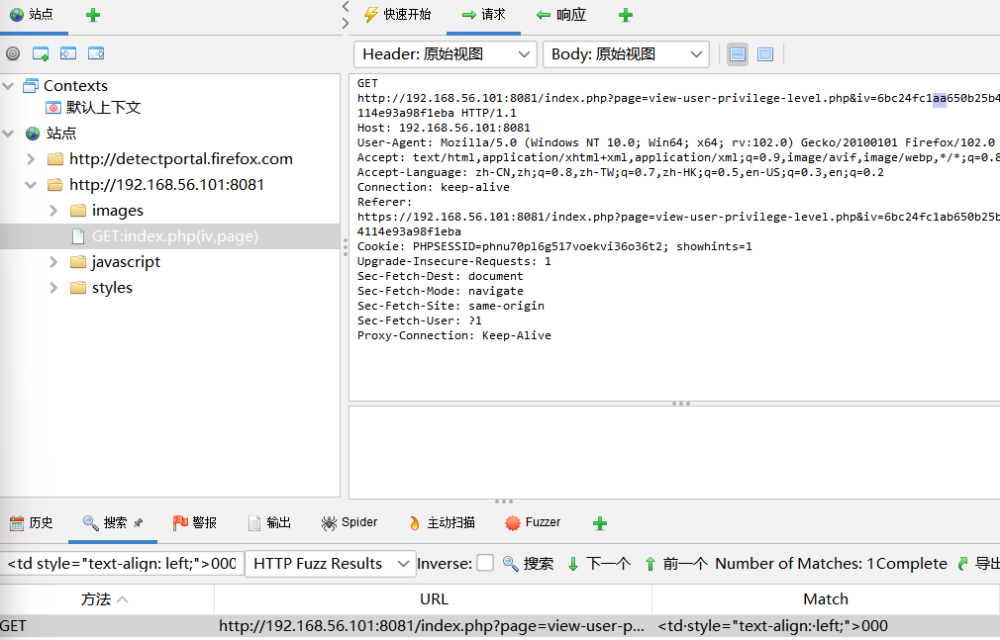    
 
 IV 字节 8 中使得 Group ID 等于 000 所需的数字由同样的方法确定。只需要对 25 注入分别注入 16 个数进行模糊测试。  
 
 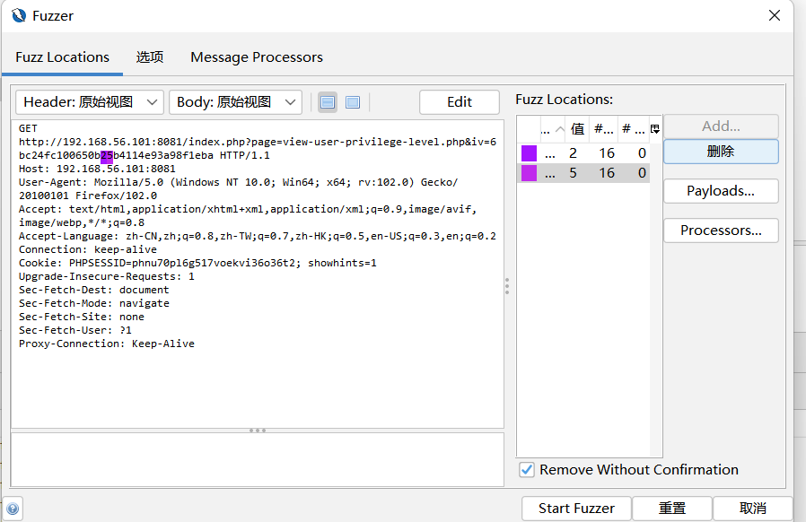  
 
 再次搜索`<td style="text-align: left;">000`得到第二个结果  
 
 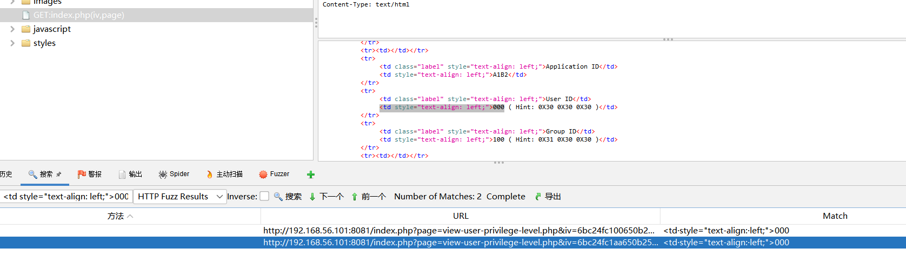  
 
 请求中 Fuzzing 将显示默认值 0x25 必须更改为 0x24。  
 
 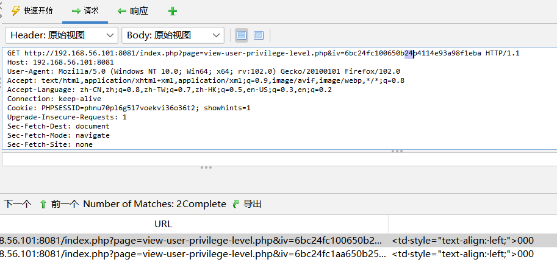  
 
 最后，URL中的 IV 参数更新为`6bc24fc1aa650b24b4114e93a98f1eba`，提交到服务器， User ID 和 Group ID 字段匹配 000，因此攻击成功。  
 
 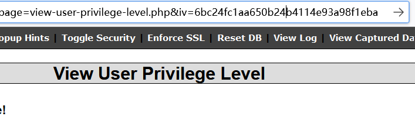  
 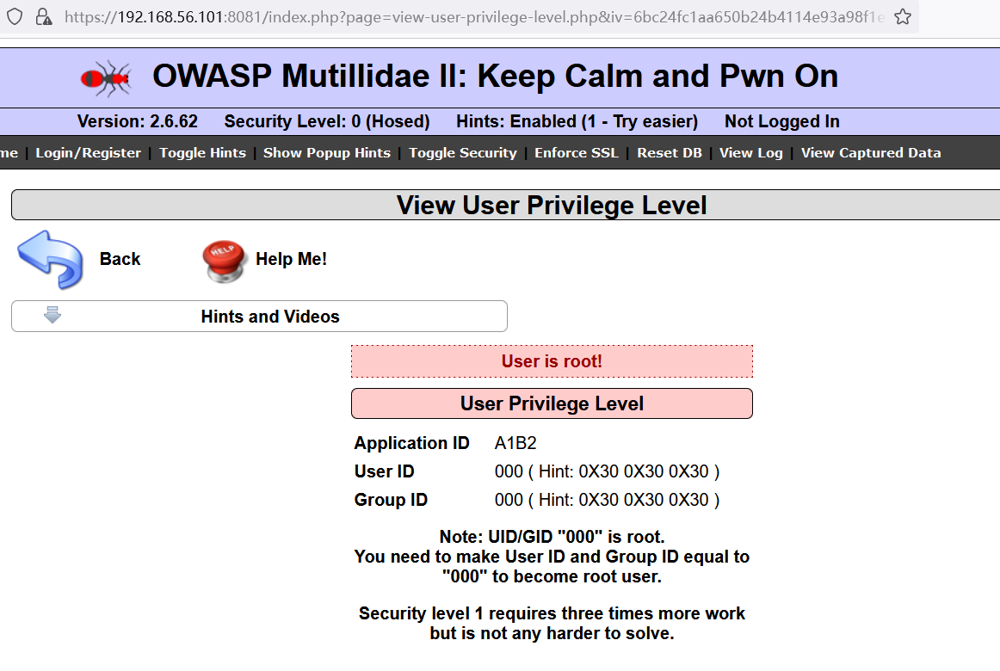  

 ## 总结
 
 通过实验，学习了 CBC Bit-flipping，加深了对分组密码的学习。此外，Mutillidae 不接受来自用户的初始化向量， IV 存储在服务器端，并且用户的任何输入都会被忽略。Mutillidae 选择通过阻止用户访问来修复位翻转漏洞改变初始化向量。因为在这个例子中 IV 可以是服务器私有的，不让用户输入 IV 可以很好地解决问题。在许多情况下，IV 必须经常更改或者在系统之间传递。在只要求 IV 唯一并且不可预测的系统中，保护了完整性。发件人可以提供加密消息的消息验证码 (MAC) (Encrypt-then-MAC) 或使用包括身份验证的加密，例如 AES-GCM。
 
 ## 参考
 
 [How to Fuzz Web Applications with OWASP ZAP](https://www.youtube.com/watch?v=tBXX_GAK7BU)  
 [How to Install and Configure Foxy Proxy with Firefox](https://www.youtube.com/watch?v=jHGNLvSpaLs)  
 [Learning CBC Bit-flipping Through Gamification](https://sansorg.egnyte.com/dl/gJdRsCxBKh)  
 《现代密码学教程》 谷利泽 郑世慧 杨义先 （第2版）Page116-118  
