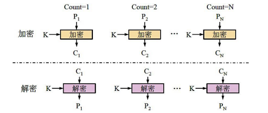
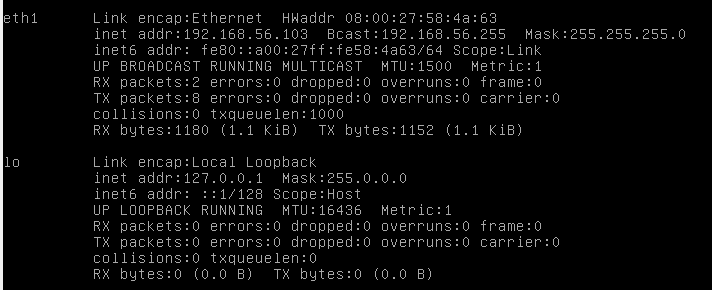
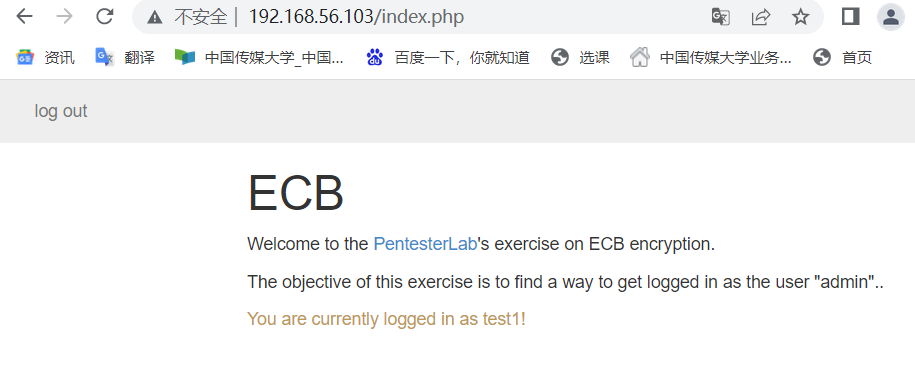
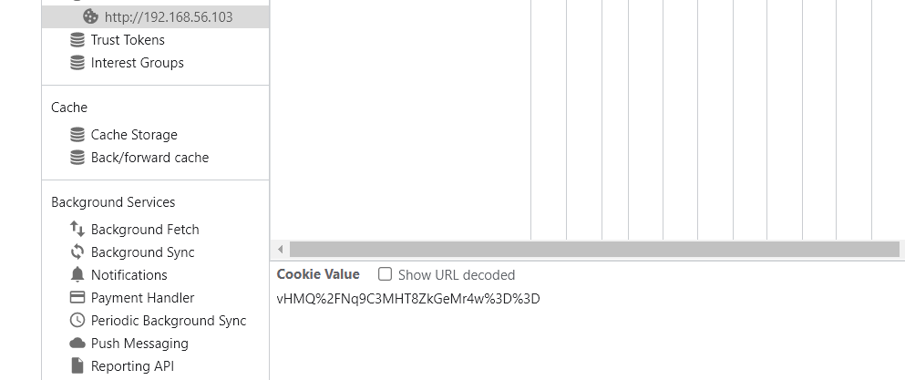
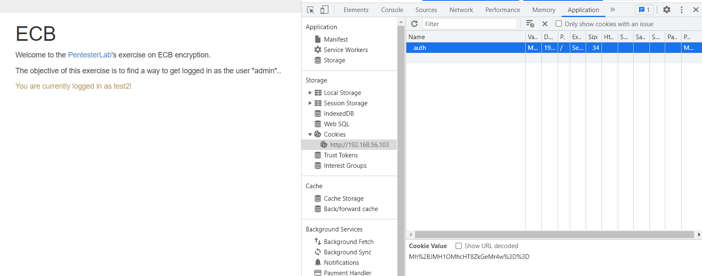
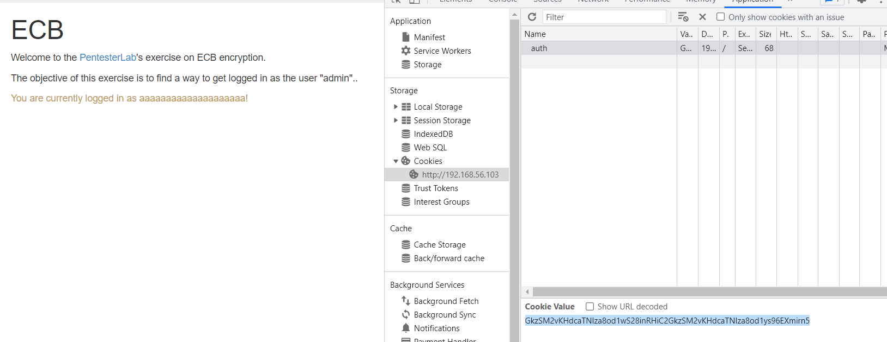
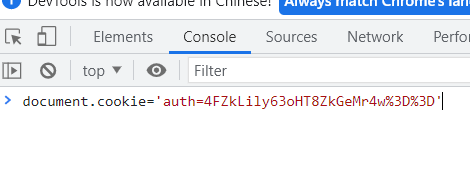
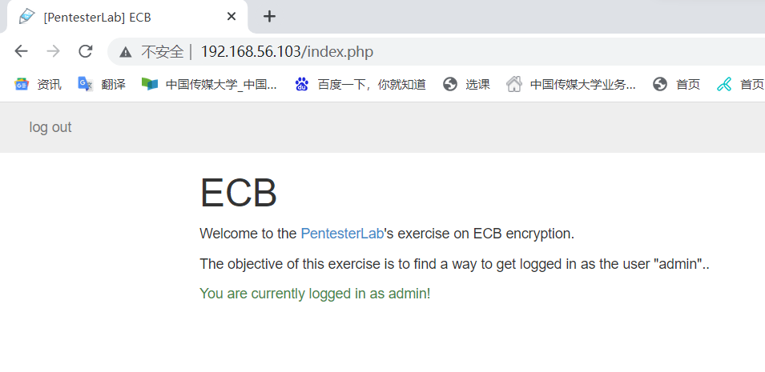
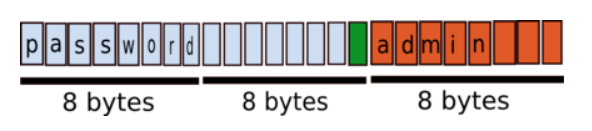
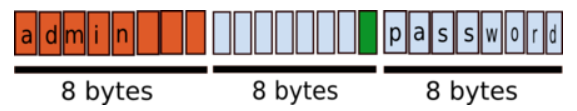

# Electronic Code Book

 本实验将实现如何篡改加密的 cookie 以访问其他用户的账户。
 ## Introduction
 实验报告将介绍如何利用 PHP 网站身份验证中的弱点。网站使用 ECB 对用户提供的信息进行加密，并使用这些信息来身份验证。
 ### 操作步骤
 - 创建两个名称相似的用户：test1 和 test2，使用相同的密码：password，查看应用程序发回的 cookie。  
 - 创建一个由相同字符组成的名字很长的用户（比如 20 次 a），然后查看应用程序发回的 cookie。尝试寻找一种模式，该模式将提供有关如何操纵信息的更多信息。  
 - 尝试使用用户名和密码创建一个用户，该用户名和密码将允许通过删除加密数据以管理员身份登录。  
 - 尝试使用用户名创建一个用户，该用户名将允许通过交换加密块以管理员身份登录。  
 
 ## ECB
 将消息分组，各组独自加密，就像一个巨大的密码本，对每个分组进行代换。  

   
 
 解密是加密的逆过程，但是有两个安全性方面的缺陷：  
 - 攻击者可以在不干扰解密过程的情况下删除加密消息中的块。  
 - 攻击者可以在不干扰解密过程的情况下移动加密消息中的块。  
 本实验将利用这两个缺陷进行攻击。  
 ### 实验准备
 官方网站下载镜像，设置好虚拟机后，`ifconfig`查看地址为 192.168.56.103  
 

 ## 漏洞检测
 - 注册一个帐户并使用此帐户登录  
  
   

 - 查看 cookie
 可以看出是由 URI 和 Base64 编码而得：`vHMQ%2FNq9C3MHT8ZkGeMr4w%3D%3D`  

   
   
 编码为 %3d%3d 的 2 个等号提示了是 base64 编码，可以通过 python 代码进行解密：  
 ```
 import base64,urllib,urllib.parse
 def decode():
    string = 'vHMQ%2FNq9C3MHT8ZkGeMr4w%3D%3D'
    b =  urllib.parse.unquot(string)   
    decode = base64.b64decode(b)              
    print(decode)
 decode()
 ```
 - 注册用户 test1 和 test2 ，使用相同的密码：password，比较 cookie。  

   

 | | test1 | test2 |
 | -- | -- | --- |
 | Cookie | vHMQ%2FNq9C3MHT8ZkGeMr4w%3D%3D |      Mh%2BJMH1OMhcHT8ZkGeMr4w%3D%3D |
 | URI-decoded cookie | vHMQ+Nq9C3MHT8ZkGeMr4w== | Mh+JMH1OMhcHT8ZkGeMr4w== |
 | base54-decoded cookie| \xbcs\x10\xfc\xda\xbd\x0bs\x07O\xc6d\x19\xe3+\xe3 | 2\x1f\x890}N2\x17\x07O\xc6d\x19\xe3+\xe3|

 能看出 test1 和 test2 解密后的 cookie 具有一些相似之处。  
 - 创建一个用户具有很长的用户名和密码，例如 20 个 a。  
  
   
  
 登录后，得到cookie为`GkzSM2vKHdcaTNIza8od1wS28inRHiC2GkzSM2vKHdcaTNIza8od1ys96EXmirn5` 解密后得到`\x1aL\xd23k\xca\x1d\xd7\x1aL\xd23k\xca\x1d\xd7\x04\xb6\xf2)\xd1\x1e \xb6\x1aL\xd23k\xca\x1d\xd7\x1aL\xd23k\xca\x1d\xd7+=\xe8E\xe6\x8a\xb9\xf9`
 能够观察出`\x1aL\xd23k\xca\x1d\xd7`反复出现了 4 次   
 `print(len('\x1aL\xd23k\xca\x1d\xd7')) = 8`  
 根据模块的大小可以推断出此 ECB 加密使用 8 字节的块大小。（这个例子用的是弱加密机制，现实生活中的示例可能会使用更大的块大小）。    
 解码后的信息还告诉我们，用户名和密码没有直接连接，并且添加了一个分隔符（因为中间的一个块与前一个不同）。   
 可以认为加密流有以下两种可能性之一：  
 - 加密流顺序包含用户名、分隔符和密码    
 - 加密流顺序包含密码、分隔符和用户名    
 通过使用长用户名和短密码创建另一个用户，得到 cookie：  
 `tInw5JDkPz20ifDkkOQ%2FPfYAW3IN5Gx1`，解密后为：`\xb4\x89\xf0\xe4\x90\xe4?=\xb4\x89\xf0\xe4\x90\xe4?=\xf6\x00[r\r\xe4lu` 我们可以看到加密使用的模式为：用户名|分隔符|密码    
 下一步为找到分隔符的大小，通过不断尝试不同长度的用户名和密码得到以下结果：    

 | Username length: | Password length: | Username+Password length: | Cookie's length (after decoding):|
 | :----:| :----: | :----: |:----: |
 | 2 | 3| 5 |8|
 | 3| 3| 6 |8|
 | 3| 4| 7 |8|
 | 4 |4| 8|16|
 |4|5|9|16|

 可以看到，当 Username+Password 的长度大于 7 时，解码后的 cookie 的大小从 8 个字节变为 16 个字节。可以从这个值推断出分隔符是单个字节，因为加密是按块完成的 8 个字节。当发回 cookie 时，看看应用程序使用了加密流的哪一部分。如果删除与分隔符对应的块之后的所有内容，可以看到仍然是经过身份验证的。当应用程序使用 cookie 时，似乎没有使用密码。那么，只需要获取正确的用户名|分隔符即可在应用程序中作为用户名进行身份验证。  

 ## 漏洞利用
 ### 删除信息
 获得管理员访问权限的最简单方法是删除一些加密数据。已知应用程序使用以下格式：    
 `\[username\]:\[separator\]`   
 并且仅在将 cookie 发送回应用程序时使用用户名。也知道每个 8 字节的块是完全独立的（ECB）。为了利用这个问题，可以创建一个包含 8 个字符的用户名后跟单词 admin：aaaaaaaaadmin    
 得到 cookie：`GkzSM2vKHdfgVmQuKXLregdPxmQZ4yvj`解码后为`\x1AL\xD23k\xCA\x1D\xD7\xE0Vd.)r\xEBz\aO\xC6d\x19\xE3+\xE3`，能够看出`\x1aL\xd23k\xca\x1d\xd7`，在之前注册 20 个 a 的用户时出现过，如果删除前 8 个字节的信息并重新编码获取新的 cookie`4FZkLily63oHT8ZkGeMr4w%3D%3D`，通过以下 python 代码进行编码：  
 ```
 def encode():
        string = "\xE0Vd.)r\xEBz\aO\xC6d\x19\xE3+\xE3"
        b = base64.b64encode(bytes(string.encode()))
        encode = urllib.parse.quote(b)
        print(encode)
 encode()
 ```
 修改 cookie 后，并将此值发送回应用程序（通过重新加载页面），得到您以管理员身份登录：  

   
   
  
 ### 交换数据
 更复杂的方法是交换数据，可以假设应用程序将使用 SQL 查询根据用户的用户名从用户那里检索信息。对于某些数据库，当使用数据类型  VARCHAR（例如与 BINARY 相反）时，以下将给出相同的结果：  
 ```
 SELECT * FROM users WHERE username='admin';
 SELECT * FROM users WHERE username='admin     ';
 ```
 字符串比较的时候会忽略 admin 后的空格，可以利用这一点来处理家里的数据。目标是得到以下加密数据：  

 `ECB(admin   [separator]password)`  
 已经知道分隔符仅由一个字节组成。可以使利用这一信息来创建完美的用户名和密码，以便能够交换块并获得正确的伪造值。  
 需要找到的用户名和密码要满足：   
 - 密码以 admin 开头，用作新用户名   
 - 加密的密码需要作为一个新的数据块的开头  
 - 用户名+分隔符的长度应该可以被块大小整除  
 通过试验，以下情况满足条件：  
 - 由密码（8 个字节）后跟 7 个空格（分隔符使用 1 个字节）组成的用户名  
 - 由 admin 后跟 3 个空格 (8 - len('admin')) 组成的密码  
 
 加密信息如图：   
  
   
  
 解密后，交换前 8 个和后 8 个字节     
 
     

 ## 总结  
 实验展示了如何在不解密的情况下篡改加密信息，并借此来访问其他帐户。可见加密不能替代签名，通过实践加深了对使用 ECB 加密来控制解密信息的学习。  
 ## 参考
 [利用ECB加密缺陷突破cookie加密](https://cloud.tencent.com/developer/article/1036683)  
  [pentesterlab ECB course](https://pentesterlab.com/exercises/ecb/course)  
    